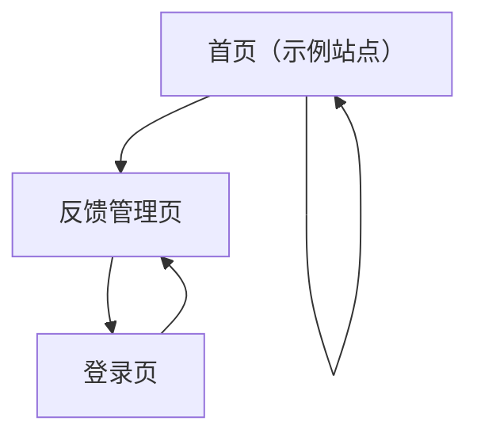

## 1. Product Overview
在你的网站/应用中提供一个固定在右下角的反馈组件，让用户随时提交反馈。
反馈数据存入 Supabase，管理员可在后台查看、处理与关闭反馈。

## 2. Core Features

### 2.1 User Roles
| 角色 | 注册方式 | 核心权限 |
|------|----------|----------|
| 访客用户 | 无需注册 | 可打开反馈面板并提交反馈 |
| 管理员 | Supabase Auth（邮箱登录） | 可登录后台查看/更新反馈状态 |

### 2.2 Feature Module
本产品最小可用需求包含以下页面：
1. **首页（示例站点）**：页面内容示例、固定右下角反馈面板（开/关、提交）。
2. **登录页**：管理员邮箱登录、登录态校验与跳转。
3. **反馈管理页**：反馈列表、筛选/搜索、详情查看、状态流转（新建/处理中/已关闭）。

### 2.3 Page Details
| Page Name | Module Name | Feature description |
|-----------|-------------|---------------------|
| 首页（示例站点） | 固定反馈入口 | 固定右下角悬浮按钮；点击展开面板；支持关闭与再次打开 |
| 首页（示例站点） | 反馈表单 | 自动记录当前页面 URL；输入反馈内容；（可选）填写联系邮箱；提交到 Supabase；展示提交中/成功/失败状态 |
| 首页（示例站点） | 基础合规提示 | 显示“反馈将用于改进产品”与简短隐私提示；提供到管理页入口（仅管理员可见） |
| 登录页 | 管理员登录 | 通过 Supabase Auth 邮箱登录；登录成功后跳转反馈管理页；失败提示 |
| 登录页 | 会话与跳转 | 已登录则直接跳转管理页；登出入口（可放在管理页） |
| 反馈管理页 | 访问控制 | 未登录访问则跳转登录页；展示当前管理员信息与登出 |
| 反馈管理页 | 反馈列表 | 按时间倒序加载；分页/加载更多；展示摘要（时间、页面、内容截断、状态） |
| 反馈管理页 | 筛选与搜索 | 按状态筛选；按关键词搜索内容/页面 URL |
| 反馈管理页 | 反馈详情与处理 | 查看完整内容与来源页面；更新状态（新建/处理中/已关闭）；记录更新时间 |

## 3. Core Process
- 访客流程：在任意页面看到右下角反馈按钮 → 点击展开面板 → 输入反馈 → 提交 → 看到成功提示并可关闭。
- 管理员流程：访问管理页 → 未登录则先邮箱登录 → 进入反馈列表 → 筛选/搜索 → 打开某条反馈详情 → 更新状态为处理中或已关闭。

