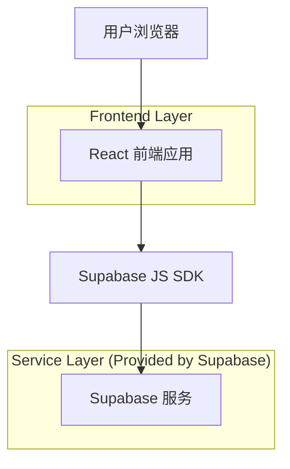
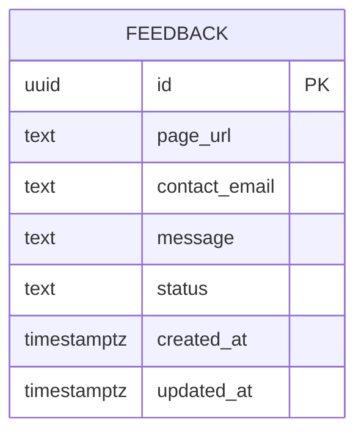

## 1.Architecture design


## 2.Technology Description
- Frontend: React@18 + vite + tailwindcss@3 + @supabase/supabase-js
- Backend: None（前端直连 Supabase，使用 RLS 做权限控制）

## 3.Route definitions
| Route | Purpose |
|-------|---------|
| / | 首页（示例站点），展示固定右下角反馈面板并提交反馈 |
| /login | 管理员登录页（Supabase Auth） |
| /admin/feedback | 反馈管理页（列表/筛选/详情/状态更新） |

## 6.Data model(if applicable)

### 6.1 Data model definition


### 6.2 Data Definition Language
Feedback 表 (feedback)
```
-- create table
CREATE TABLE feedback (
  id UUID PRIMARY KEY DEFAULT gen_random_uuid(),
  page_url TEXT NOT NULL,
  contact_email TEXT NULL,
  message TEXT NOT NULL,
  status TEXT NOT NULL DEFAULT 'new' CHECK (status IN ('new','in_progress','closed')),
  created_at TIMESTAMPTZ NOT NULL DEFAULT NOW(),
  updated_at TIMESTAMPTZ NOT NULL DEFAULT NOW()
);

-- indexes
CREATE INDEX idx_feedback_created_at ON feedback (created_at DESC);
CREATE INDEX idx_feedback_status_created_at ON feedback (status, created_at DESC);

-- RLS
ALTER TABLE feedback ENABLE ROW LEVEL SECURITY;

-- policy 1: 允许匿名/公开用户提交反馈（仅 INSERT）
CREATE POLICY "feedback_insert_anon" ON feedback
FOR INSERT
TO anon
WITH CHECK (true);

-- policy 2: 允许已登录用户（管理员）读取与更新反馈
CREATE POLICY "feedback_select_authenticated" ON feedback
FOR SELECT
TO authenticated
USING (true);

CREATE POLICY "feedback_update_authenticated" ON feedback
FOR UPDATE
TO authenticated
USING (true)
WITH CHECK (true);

-- grants（按 Supabase 典型做法分配基础/完整权限）
GRANT SELECT ON feedback TO anon;
GRANT ALL PRIVILEGES ON feedback TO authenticated;
```

备注：如果你希望“访客不能读取任何反馈”，可以移除 `GRANT SELECT ON feedback TO anon;` 并保持仅 INSERT 的 RLS 策略。
