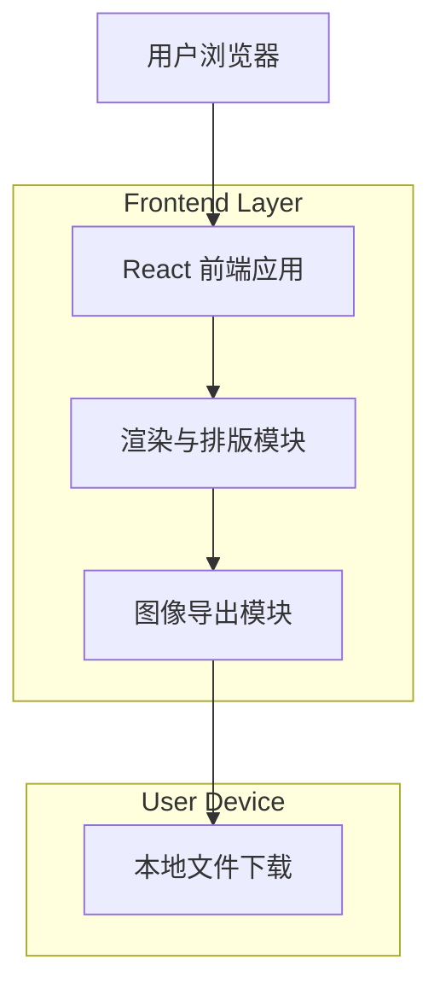

## 1.Architecture design

## 2.Technology Description
- Frontend: React@18 + vite + tailwindcss@3
- Rendering/Export: html2canvas（或 dom-to-image）+ file-saver
- Backend: None

## 3.Route definitions
| Route | Purpose |
|---|---|
| / | 祝福卡生成页：填写信息、选择模板、实时预览、一键生成 |
| /preview | 预览与下载页：高清预览、返回编辑、选择格式/尺寸下载 |

## 6.Data model(if applicable)
无（默认不保存用户数据；生成在本地完成）。
